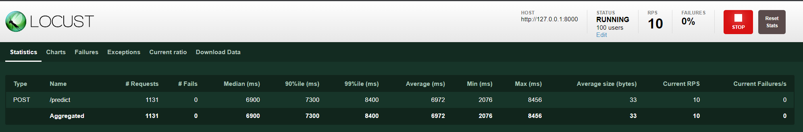

# Request Batching Example with Redis

Disclaimer: This is not a production-ready code. It is just a test of my idea to improve inference speed!

## TLDR

Batching the requests and making batch predictions gives much better RPS but making this system robust is way harder.

## What is this?

Let's say we have a test set that contains 1000 elements. Which one is faster: 

 1 - Looping through the requests and predicting one by one \
 2 - Making the predictions in batches
 
Thanks to modern GPUs and CPUs the second choice is way much faster. So I had a question, can we batch those requests,
make the prediction in batches, and send the results back? This is what I came up with:

The plan is that when a client gets a request, it will publish to Redis the "prediction" topic with a unique id and
start to listen to a topic with its unique id. If this id is, say "123". It will start to listen topic "123",

The Prediction service will listen to the "prediction" topic and add those requests to a list. When the length of the list
is N. It will take all requests in the list, make a batch prediction and send every result to its topic using the given
unique id.

## Test Results

I did my tests on a computer with:

- RTX 2060 GPU
- AMD Ryzen 5 1600F CPU
- 32 GB Tam
- Ubuntu 20.04 with Windows WSL2

I've used a custom container I made from tensorflow-gpu image. I run the container inside Ubuntu which is inside
Windows with WSL2 (I really love it). 

All backend services are made with FastAPI and I've tried to use async programming for both use cases.

This is the model I use for testing:

Real-time example with 100 users. Median ms 7000, RPS 10.

Real-time example with 5000 users, it couldn't make it and I had to stop the test.

Redis request batch example with 100 users, n = 32. Median ms and 1200 RPS 80.

Redis request batch example with 100 users, n = 64. Median ms 1400 and RPS was between 83 - 89.

Redis request batch example with 5000 users, n = 64. Median ms 46000 and RPS was between 86. That much request seems
like too much for 1 service and it seems like it needs to scale. I had to increment the timeout value to 5 min to make sure
it won't crash or return failed response.

## Challenges and Possible Problems

- How can we decide N? Can we change it dynamically?
- Should N and prediction batch size be the same? N = 64, batch_size = 32 means prediction will take 2 epochs.
- When traffic becomes too much, how do we handle connection errors? I increase the wait timeout and retry to publish and wait 3 times in case the prediction server is unavailable or cannot answer on time 

## How to do better?

- The Prediction server contains the model too. If you serve the model in TF Serve etc. you will get more faster responses.
- I'm open to other suggestions!